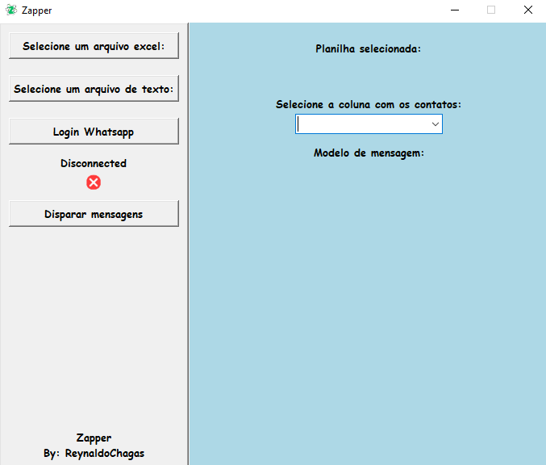
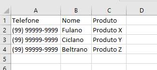
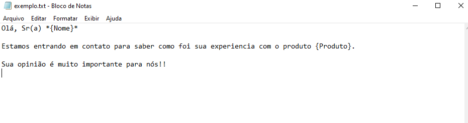

# ZapperAPP
## Aplicação para Envio automatizado de mensagens no Whatsapp

No setor onde trabalho, enviamos milhares de mensagens via Whatsapp diariamente. Após iniciar os estudos de Python, pensei em uma forma de automatizar estes envios. Foi então que criei a aplicação chamada Zapper, utilizando Python e algumas de suas bibliotecas, tais como: Selenium, Pandas e Tkinter.

## Funcionamento

### Base de dados

A base de dados necessita ter a extensão .xls (planilha excel) e ao menos uma coluna, contendo os telefones que a aplicação irá utilizar para enviar as mensagens. Caso as mensagens necessitem de alguma personalização, as informações podem ser incluidas em outras colunas no mesmo arquivo.

### Modelo de mensagem

O modelo de mensagem deverá ser um arquivo com extensão .txt contendo o texto desejado. Caso exista alguma personalização entre as mensagens enviadas para cada contato, o modelo deverá utilizar o nome da respectiva coluna entre colchetes, conforme o exemplo a seguir:

Observe que é possivel utilizar a formatação de textos do Whatsapp no arquivo txt, como, por exemplo, palavras em negrito utilizando asteriscos (*).
